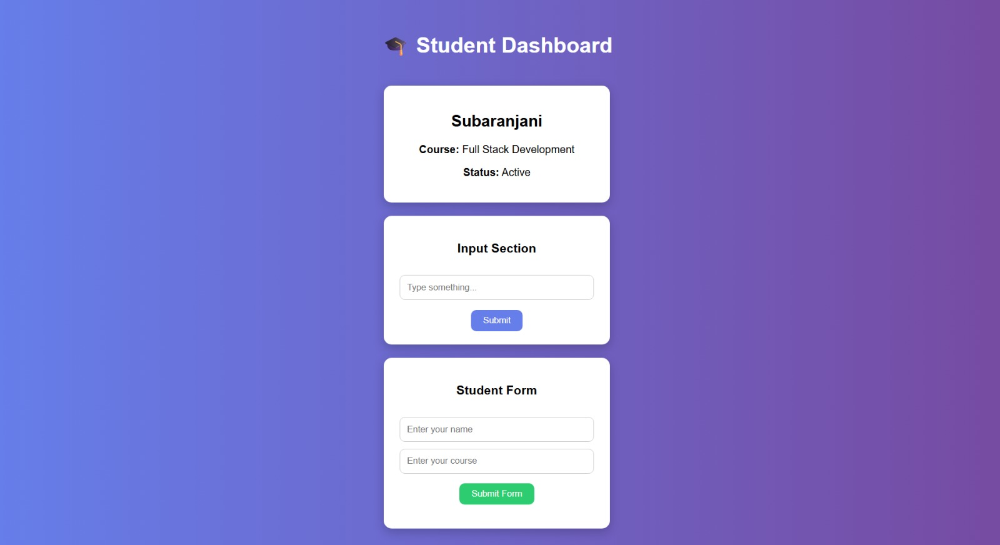
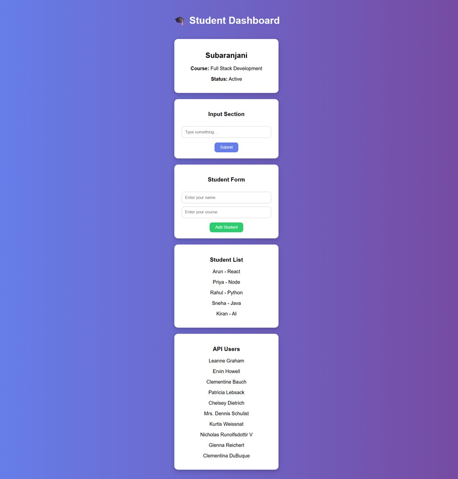
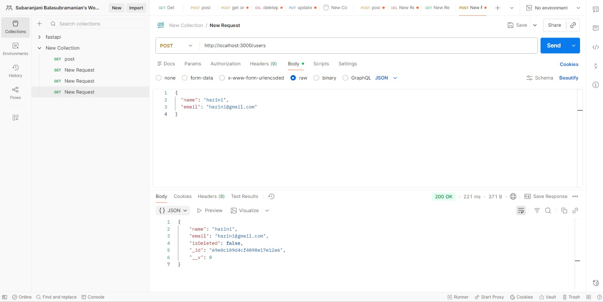
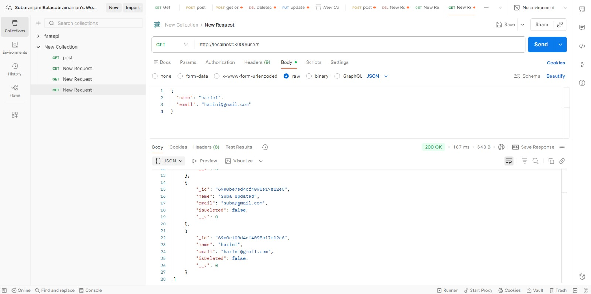
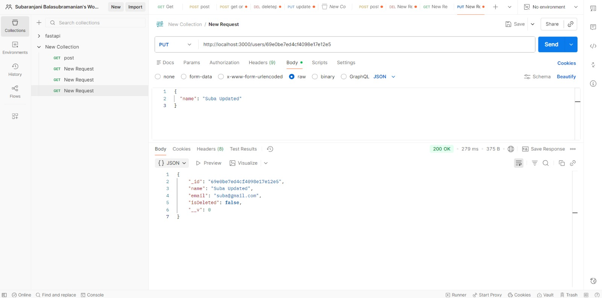
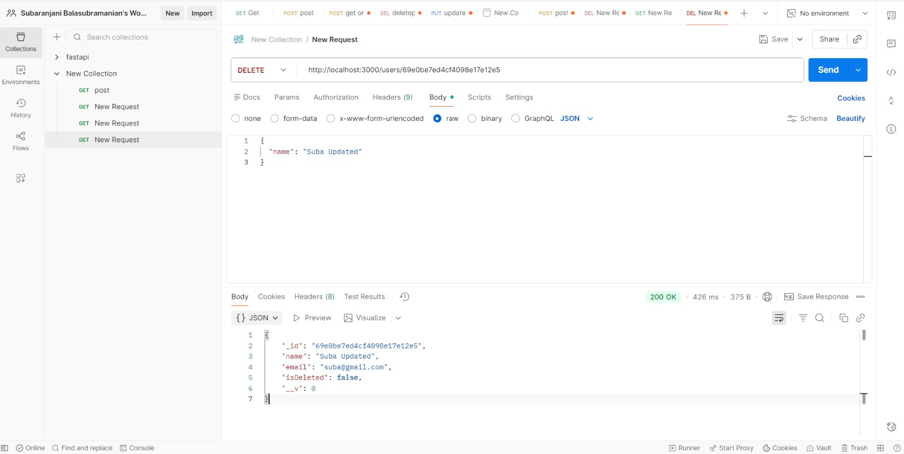

# 🚀 Full Stack Development with AI Bootcamp

## 👩‍💻 Student Information
- **Name:** Subaranjani  
- **Program:** Full Stack Development with AI Bootcamp  

---

# 📅 Day 1 - React Basics

## 📌 Topics Covered
- ✅ Component Creation (StudentCard)
- ✅ Props (Parent → Child communication)
- ✅ useState (State Management)
- ✅ Event Handling (Button Click)
- ✅ Form UI (Handling user input)

## 💻 Project: Student Dashboard

## ✨ Features
- 🎓 Display student details using reusable components  
- 🔄 Pass data using props  
- 🧠 Manage state using useState  
- 🖱️ Handle button click events  
- 📝 Capture user input using form  
- 📊 Display entered data dynamically  

---
## 📸 Output Screenshots

### Student Card UI



# 📅 Day 2 - Advanced React

## 📌 Topics Covered
- ✅ List Rendering using `map()`
- ✅ Unique keys for list items
- ✅ Form submission handling
- ✅ Dynamic data update
- ✅ Fetch API integration

## ✨ Features Added
- 📋 Display student list dynamically  
- ➕ Add new student using form  
- 🔄 Real-time UI update  
- 🌐 Fetch users from API  
- 👥 Display API users in UI  

---
## 📸 Output Screenshots

### Student Dashboard + API + List Rendering



## 📂 Folder Structure

```
fullstack-ai-bootcamp/
│
├── student-dashboard-app/
│   ├── public/
│   ├── src/
│   │   ├── components/
│   │   │   └── StudentCard.js
│   │   ├── App.js
│   │   ├── index.js
│   │   └── App.css
│   ├── package.json
│   └── README.md (frontend part if needed)
│
├── backend-day3/
│   ├── index.js
│   ├── package.json
│   ├── package-lock.json
│   ├── .env
│   └── node_modules/
│
├── screenshots/
│   ├── day1.jpeg
│   ├── day2.jpeg
│   ├── post.jpeg
│   ├── get.jpeg
│   ├── put.jpeg
│   └── delete.jpeg
│
└── README.md
```

---

# 📅 Day 3 - Backend Development (Node.js + MongoDB)

## 📌 Topics Covered
- Express.js Server Setup
- MongoDB Atlas Integration
- CRUD API Development
- Soft Delete Implementation
- Postman API Testing
- Environment Variables (.env)

---

## ✨ Features Added
- 🗄️ MongoDB Database Connection  
- 📡 REST API for users  
- ✏️ Update user data  
- 🗑️ Soft delete using isDeleted flag  
- 🔄 Postman testing  

---

## 🧪 API Endpoints

- POST /users → Create user  
- GET /users → Get all active users  
- PUT /users/:id → Update user  
- DELETE /users/:id → Soft delete user  

---

# 📸 Postman API Screenshots

## 🟢 Create User (POST)


## 🟢 Get Users (GET)


## 🟢 Update User (PUT)


## 🟢 Soft Delete (DELETE)


## 🟢 Final GET (After Delete Check)


---

# 🛠️ Technologies Used

## Frontend
- ⚛️ React.js  
- 🟨 JavaScript (ES6+)  
- 🎨 CSS  
- 🌐 HTML  
- 🌍 Fetch API  

## Backend
- 🟢 Node.js  
- 🚀 Express.js  
- 🍃 MongoDB Atlas  
- 📦 Mongoose  
- 🔐 dotenv  

---

# ▶️ How to Run Project

## Frontend
```bash
cd student-dashboard-app
npm install
npm start
---

# 🛠️ Technologies Used
- ⚛️ React.js  
- 🟨 JavaScript (ES6+)  
- 🎨 CSS  
- 🌐 HTML  
- 🌍 Fetch API  

---
**## Backend **
cd backend-day3
npm install
npx nodemon index.js
